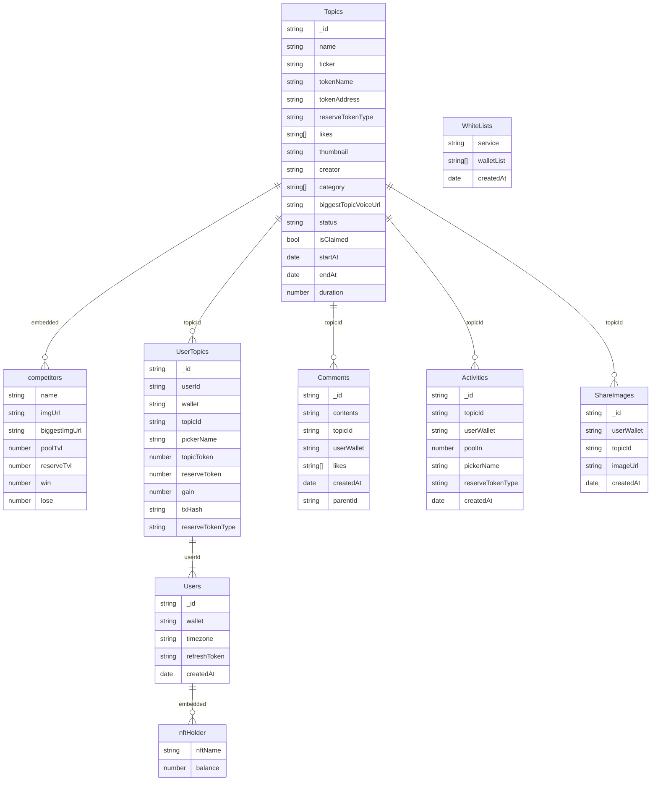

# homo-memetus-server

### ERD v0.1

```mermaid
erDiagram
  Topics ||--o{ competitors : embedded
  Topics ||--o{ UserTopics : topicId
  Topics ||--o{ Comments : topicId
  Topics ||--o{ Activities : topicId
  Topics ||--o{ ShareImages : topicId

  UserTopics ||--|{ Users : userId

  Users ||--o{ nftHolder : embedded

  Users {
    string _id
    string wallet
    string timezone
    string refreshToken
    date createdAt

    %% An array of Competitor objects is embedded here
  }

  nftHolder {
    string nftName
    number balance
  }


  Topics {
    string _id
    string name
    string ticker
    string tokenName
    string tokenAddress
    string reserveTokenType
    string[] likes
    string thumbnail
    string creator
    string[] category
    string biggestTopicVoiceUrl
    string status
        %% onGoing, ended, upComing
    bool isClaimed
    date startAt
    date endAt
    number duration

    %% An array of Competitor objects is embedded here
  }
  competitors {
    string name
    string imgUrl
    string biggestImgUrl
    number poolTvl
    number reserveTvl
    number win
    number lose
  }

  UserTopics {
    string _id
    string userId
    string wallet
    string topicId
    string pickerName
    number topicToken
    number reserveToken
    number gain
    string txHash
    string reserveTokenType
  }

  Comments {
    string _id
    string contents
    string topicId
    string userWallet
    string[] likes
    date createdAt
    string parentId
  }

  Activities {
    string _id
    string topicId
    string userWallet
    number poolIn
    string pickerName
    string reserveTokenType
    date createdAt
  }

  ShareImages {
    string _id
    string userWallet
    string topicId
    string imageUrl
    date createdAt
  }

  WhiteLists {
    string service
    string[] walletList
    date createdAt
  }
```
